# CLAUDERIM — The Shattered March

An open-world action RPG for the browser, drawing its gameplay from **Skyrim** (open world,
use-based skills, perks, crafting, factions of place, readable lore) and **Dark Souls**
(stamina combat, dodge-roll i-frames, parries, poise, bonfire-style shrines, souls-style
ember economy, telegraphed bosses, "you died").

Zero dependencies. Zero build step. Pure vanilla JavaScript + Canvas + WebAudio.

**Play it in first person** — a software raycaster renders the whole world from inside it:
mouse-look with pitch, head-bob, an animated viewmodel for every weapon, sun and moon,
cloud banks, starfields, and firelight pooling on the ground. Press **V** any time for the
classic top-down view. Same world, same systems, both perspectives — your choice is saved.


<p align="center">
  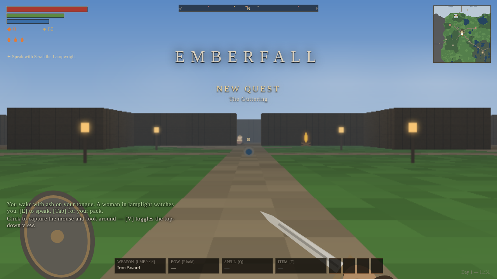
  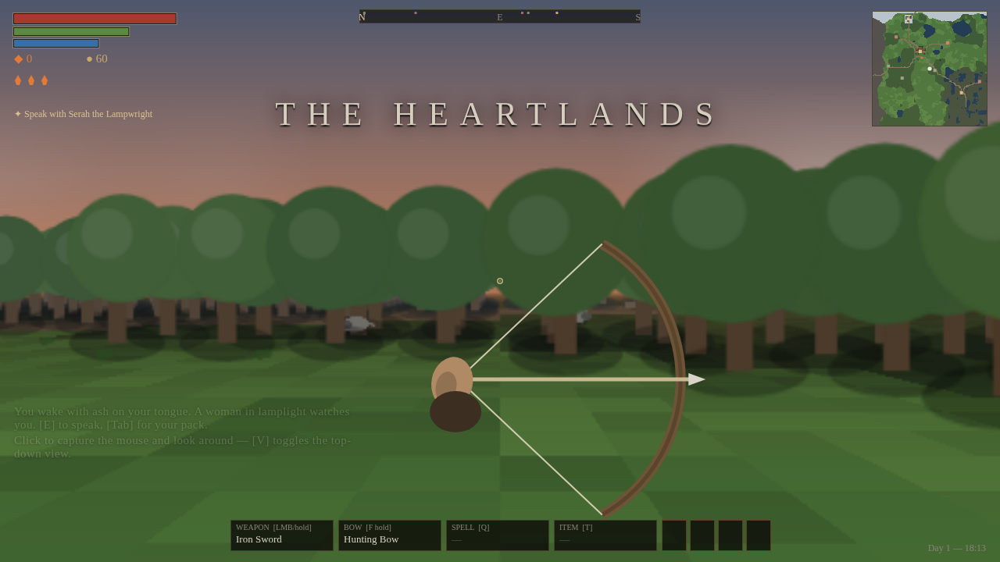
  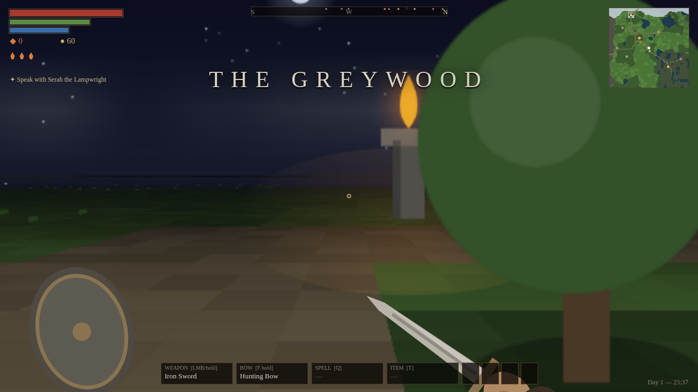
  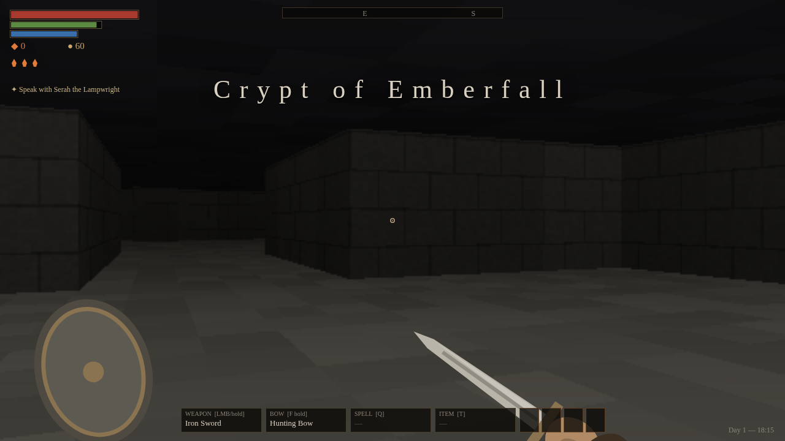
  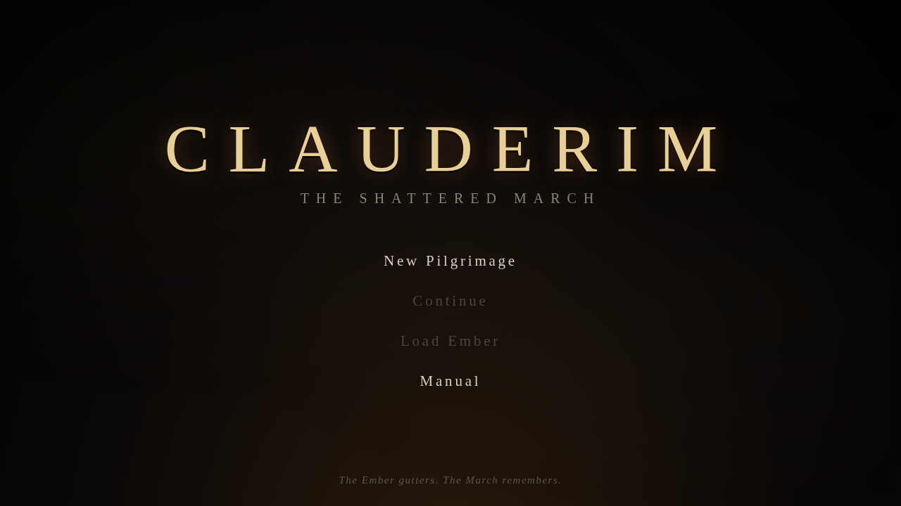
  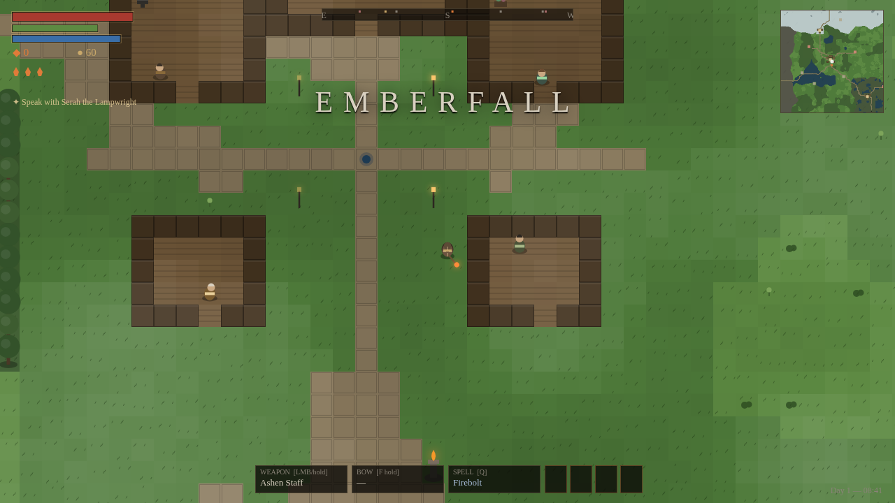
  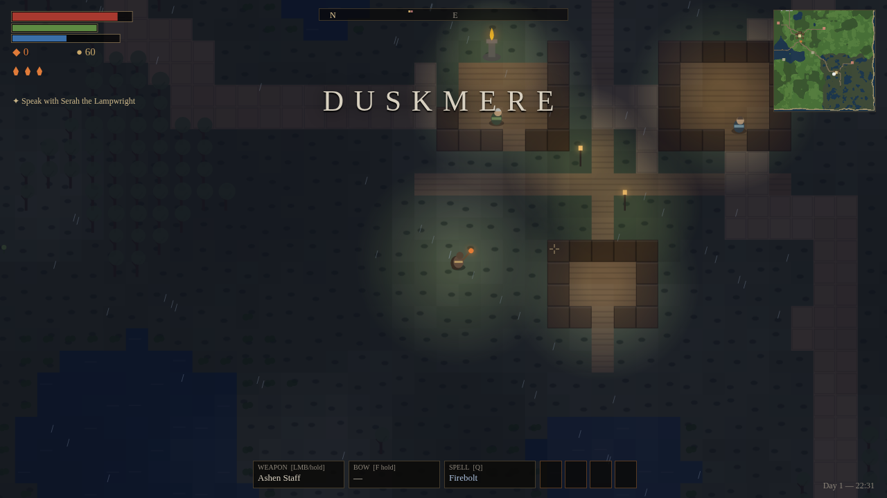
  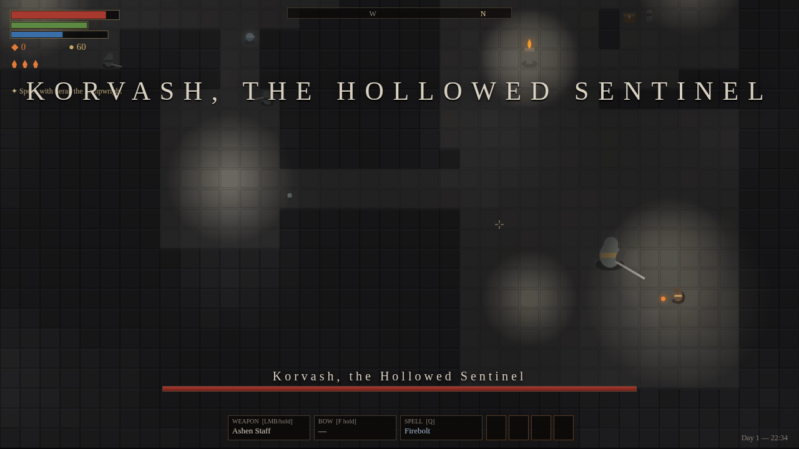
  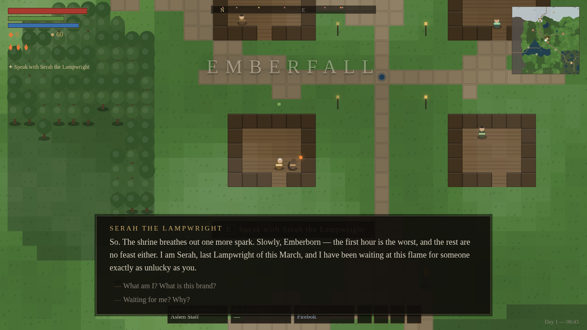
  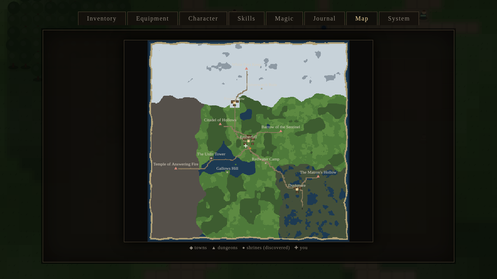
  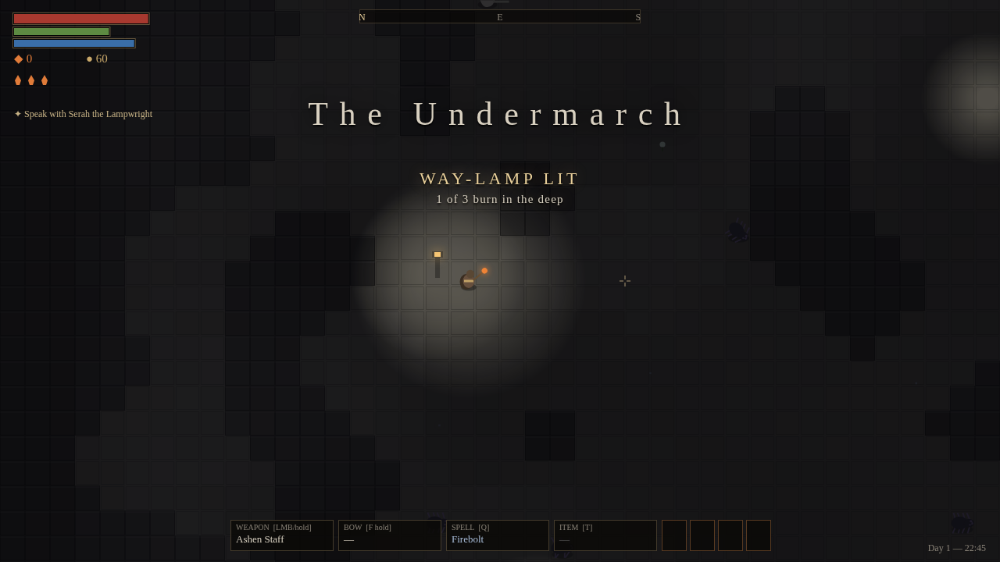
  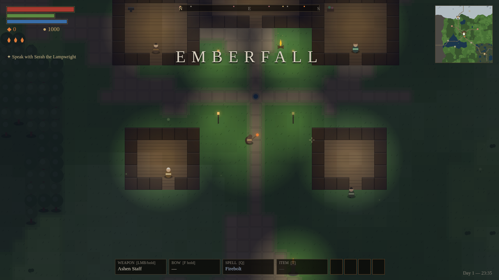
</p>

---

## Play

Open `index.html` in any modern browser. That's it.

To serve it instead (recommended for clean reloads):

```bash
python3 -m http.server 8080
# then visit http://localhost:8080
```

Run the headless test suite:

```bash
node test/smoke.js
```

---

## Controls

| Input | Action |
|---|---|
| **V** | Toggle first-person / top-down view |
| **Mouse / ←→** | Look & turn (first person; click to capture the mouse) |
| **WASD** | Move (FP: W/S walk, A/D strafe) |
| **Shift** | Sprint (drains stamina) |
| **Space** | Dodge roll (i-frames; speed scales with equip load) |
| **Ctrl / X** | Sneak |
| **LMB tap / hold** | Light / heavy attack |
| **RMB hold** | Block — raise at the last instant to **parry** |
| **F (hold)** | Draw bow; release to loose |
| **Q** | Cast equipped spell |
| **1–4** | Speak Edicts of the Old Tongue |
| **R** | Drink the Ember Flask |
| **E** | Interact (shrines, people, chests, herbs, doors) |
| **Tab / I** | Menu · **M** map · **J** journal · **C** character · **Esc** system |

---

## The world

**Clauderim, the Shattered March** — a 400×400-tile seamless overworld across five biomes
(the Heartlands, the Greywood, Mirkfen Mire, the Frostpeaks, the Ashlands), ringed by the
Cinder Coast. Day/night cycle, biome weather (rain, snow, fog, ashfall), roads, lakes,
and a living spawn ecology.

- **3 towns** — Emberfall (forge, stillroom, inn, lamp-house), Duskmere on its swamp stilts,
  Frosthollow under the peaks — with **10 NPCs** who keep day posts and walk home at night,
  branching dialogue, shops, campfires, wells, and an inn bed.
- **8 dungeons** — a town crypt, four Warden lairs, a sunken chapel, the Citadel of
  Hollows, and the hidden **Undermarch** beneath the Great Sink — generated as
  rooms-and-corridors keeps or cellular-automata caverns.
- **9 overworld shrines** + one before each Warden: rest (heal, refill flask, respawn the
  world, autosave), level up with embers, and fast-travel between any shrines you've knelt to.
- **6 bosses + 1 miniboss** — including the optional superboss *Echo of Ald* — each with
  telegraphed patterns, a second phase, a fog-walled arena that seals behind you, and a
  souls-style intro banner and health bar.
- **A living wild**: huntable deer and hares, smoldering *ashen elite* spawns, fireflies
  at dusk, drifting ash, frost glints, marsh spores, swaying canopies, biome weather.

## The mechanics

- **Stamina governs everything** — attacks, blocks, rolls, sprints.
- **Embers are souls**: enemies drop them, leveling consumes them, death scatters them where
  you fell. Reach them again to reclaim them; die first and they're gone.
- **Resting wakes the world**: shrines restore you and respawn every non-boss enemy.
- **Six attributes** (Vigor, Endurance, Mind, Strength, Finesse, Will), Dark Souls level
  costs, weapon **scaling letters** (S/A/B/…) per attribute.
- **13 use-based skills** (One-/Two-Handed, Archery, Block, Light/Heavy Armor, Destruction,
  Restoration, Sneak, Smithing, Alchemy, **Speech**, **Enchanting**), each with a 4-perk
  tree; a perk point every 5th skill level. Speech moves shop prices and unlocks
  **persuasion** in dialogue.
- **Equip load** sets your roll: fast / medium / fat / none.
- **Poise & stagger**, parry → riposte windows, guard breaks, backstab sneak multipliers,
  shield-bearing enemies that block.
- **Status effects**: burn, poison, frost-chill, bleed, shock — on both sides of the fight.
- **13 spells** across Destruction, Restoration and **Conjuration**; staves amplify spell power.
- **4 Edicts** (shouts) taken from the Wardens' corpses: VAL (force), SUTH (life-drain),
  KYR (time-slow), THUR (fire breath).
- **Crafting, three pillars + two trades**: smithing at forges (ore → ingots → steel and
  silvered weapons) with **weapon honing** (+8%/tier), alchemy at benches (9 gatherable
  reagents grown by biome), **enchanting at Lampwright altars** (eleven ember-powered
  workings: elemental brands, lifesteal, wards, vitality — potency scales with the skill),
  and **cooking** hunted meat at campfires.
- **The Wardens' Ledger**: a radiant bounty board by the Emberfall inn — rotating cull /
  gather / elite-hunt contracts, refreshed at every rest, paid in gold and embers, scaled
  by cycle, sweetened by Speech.
- **Fishing**: buy a rod, face open water, cast, and strike on the bite — biome fish
  tables, cookable catches, and the occasional drowned purse or tideglass pearl.
- **Conjuration**: summon an **ember sprite** that picks its own targets and opens fire,
  or a **Lampwright's lantern** that walks the dark beside you.
- **A bestiary** in the journal that remembers every foe the March has thrown at you.
- **Quick slot** (`T`), grave-searching (loot or angry tenants), drinkable wells,
  parry/heavy-hit **hit-stop**, low-health vignette, lost-ember compass beacon.
- **~80 items** — weapons, armor sets (light/heavy with stealth and resist identities),
  shields, trinkets, consumables, bombs — every one carrying its own lore line.
- **10 readable in-world books** of deep lore, sold by fitting vendors and found in chests.
- **11 side quests + the main questline** with a journal, objective tracker, compass quest
  markers, and a final binary choice over the First Ember — after which **the world goes
  on**: keep playing in your changed March, or begin the **next cycle** (NG+) at any
  shrine — the world renews and hardens, and you keep everything you are and carry.
- **The Cinder Coast**: the Tidelost Strand, where Quartermaster Senn camps beside the
  ribs of the GLAD PENNY and her drowned crew still keeps station — relieve the watch,
  stand down Captain Veyra, and harvest tideglass pearls for the altars.
- **The White Pass**: two armies frozen mid-charge for four hundred years — search the
  soldiers (some object), fell the Hymnkeeper, and sound the horn that ends their watch.
- **The Gauntlet of Sparks**: Brann's wave-survival pit. Embers per wave, a champion's
  ring at five, and no upper limit on how deep the sand gets.
- **3 save slots** (localStorage), autosave at every shrine rest, full world-state
  persistence from a regenerating seed.

## The story

The First Ember is dying. The Pale King Maerodric — a good man, which is the worst part —
sealed it in his vault four hundred years ago to ration its light, and light rationed is
darkness with a schedule. Four Wardens fled his court carrying Sigils, words of the Old
Tongue. You are **Emberborn**: a spark thrown by a guttering fire, refusing briefly,
magnificently, to go out.

Claim the four Sigils. Open the Citadel of Hollows. Then answer the only question the
Ember has left: *burn again, or rest?*

---

## Architecture

| File | Role |
|---|---|
| `js/util.js` | seeded RNG, value-noise/fBm, math & DOM helpers |
| `js/state.js` | the global game-state singleton `G` |
| `js/data_*.js` | content: items, spells/Edicts, skills/perks/origins, bestiary, lore books, quests, NPC dialogue trees |
| `js/world.js` | overworld & dungeon generation, collision, biomes, spawners |
| `js/entities.js` | enemy AI, boss pattern engine, NPCs, projectiles, hazards, particles |
| `js/player.js` | the Emberborn: stats, inventory, equipment, action state machine |
| `js/combat.js` | the full damage pipeline both directions |
| `js/quests.js` | quest state machine & journal |
| `js/audio.js` | procedural WebAudio SFX + generative mood score |
| `js/save.js` | localStorage save slots |
| `js/render.js` | chunk-cached terrain, vector characters, lighting, weather, HUD |
| `js/render_fp.js` | first-person raycaster: walls, cast floors, sky, billboards |
| `js/ui.js` | every DOM interface: menus, dialogue, shops, crafting, shrine, endings |
| `js/main.js` | boot, game loop, transitions, interaction, death/respawn, clock |
| `test/smoke.js` | headless full-lifecycle test harness (60+ assertions) |

See `docs/DESIGN.md` for systems detail and `docs/LORE.md` for the world bible.

*The Ember gutters. The March remembers.*
