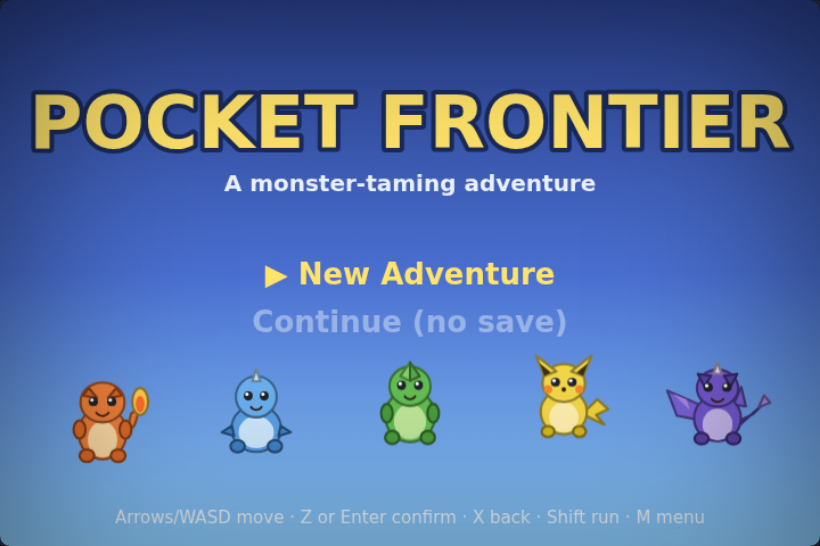
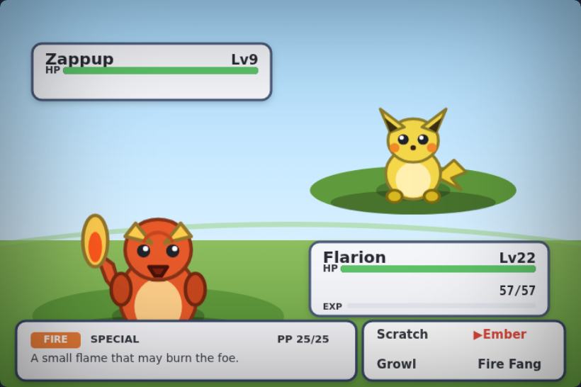
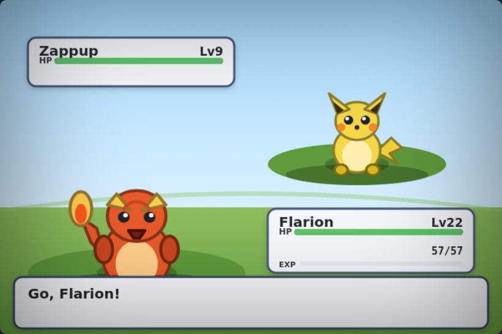
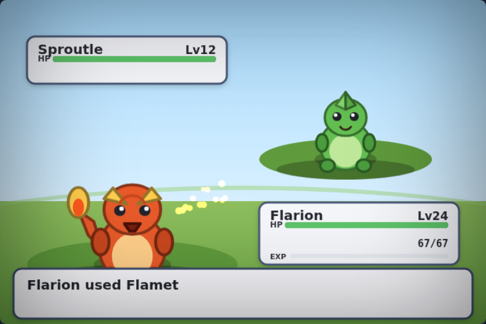
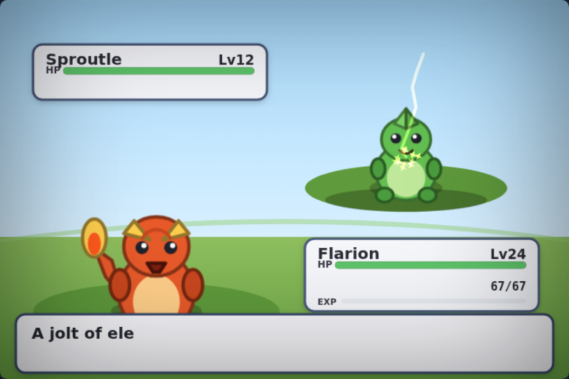
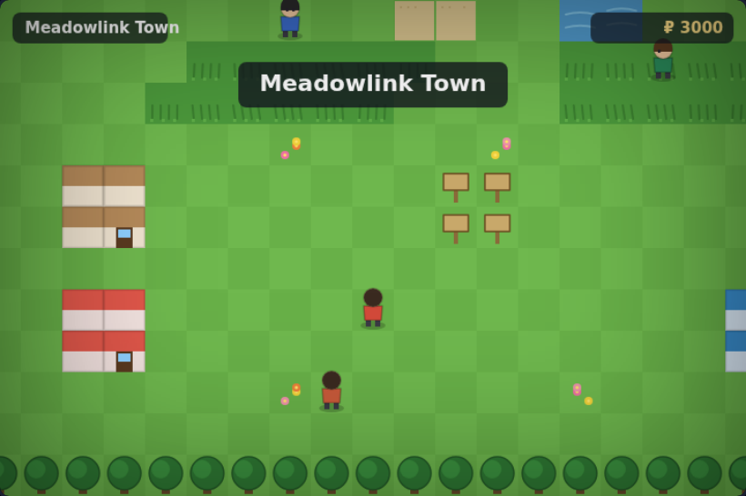
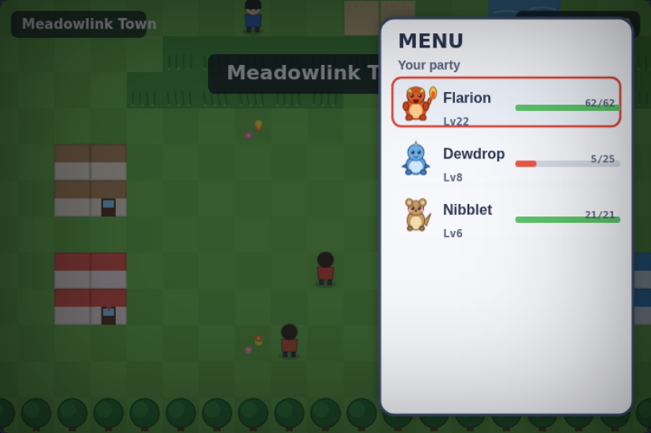
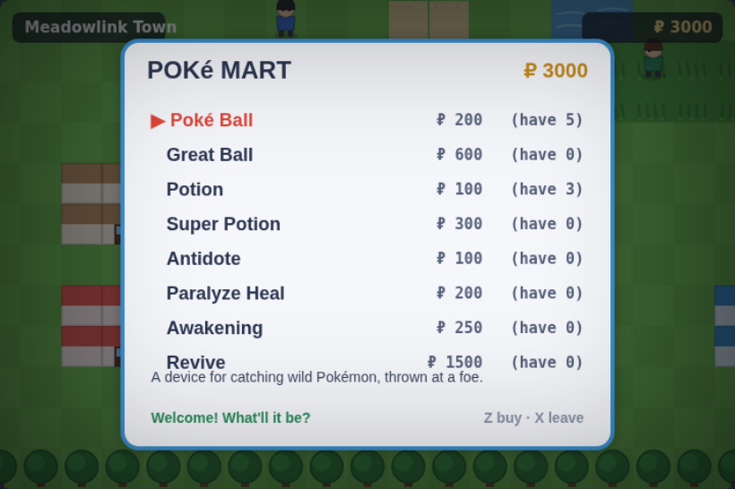

# POCKET FRONTIER — A Monster-Taming Adventure

A creature-collecting RPG for the browser, built in the spirit of **Pokémon FireRed** and
**Black & White**: walk the routes, wade into the tall grass, and fight **animated
turn-based battles** with type match-ups, status conditions, capture, evolution and a
scrolling battle log that narrates every move.

Zero dependencies. Zero build step. Pure vanilla JavaScript + Canvas + WebAudio — the same
philosophy as its parent project, CLAUDERIM.


<p align="center">
  
  
  
  
  
  
  
  
</p>

---

## Play

Open `pokemon/index.html` in any modern browser. That's it.

To serve it instead (recommended):

```bash
cd pokemon
python3 -m http.server 8080
# then visit http://localhost:8080
```

Run the headless test suite (53 assertions across every system):

```bash
node pokemon/test/smoke.js
```

---

## Controls

| Input | Action |
|---|---|
| **Arrow keys / WASD** | Walk · move the cursor in menus |
| **Z / Enter / Space** | Confirm · advance battle text (hold to fast-forward) |
| **X / Backspace** | Cancel · back out |
| **Shift** | Run (overworld) |
| **M / Esc / Tab** | Open the pause menu |

The whole game is drawn on one canvas; there is no other UI to learn.

---

## What's in it

### Turn-based battles, done properly
- The **real damage formula** — level, Attack/Defense (physical) or Sp. Atk/Sp. Def
  (special), a random spread, **STAB**, critical hits, and the full **18-type
  effectiveness chart** (`fire→grass` is super effective, `electric→ground` does nothing,
  `grass→water/ground` is 4×, and so on).
- **Five status conditions** — burn, poison, paralysis, sleep and freeze — each with its
  own turn logic (chip damage, halved Attack/Speed, missed turns, thawing) and type
  immunities.
- **Stat stages** (−6…+6) from moves like Growl, Swords Dance and Screech.
- **Move variety**: priority moves, high-crit moves, multi-hit, never-miss, HP drain,
  recoil, flinch, and self-heal.
- A **thinking foe AI** that weighs type effectiveness and STAB, with a dash of
  unpredictability.
- **FIGHT · BAG · POKéMON · RUN** — switch mid-battle (the foe gets a free turn),
  use Potions and status cures, or throw a Ball.

### Text descriptions of every move
Highlight any move and the battle menu shows its **type, category, PP and a Pokédex-style
description** — "*A small flame that may burn the foe.*", "*Sharp-edged leaves. Cuts land
critical hits often.*" The battle log narrates each turn: who used what, whether it was
super effective, critical, or left the foe burned.

### Animations everywhere
- **Fire streams, water arcs, forked lightning, spinning leaves, ice shards, psychic
  rings, falling boulders** and more — a per-type particle engine with additive glow.
- **Animated HP bars** that drain smoothly (green → yellow → red), a filling **EXP bar**,
  hit-flashes, screen shake, and squash-and-stretch on impact.
- **Send-out pops**, faint slides, a full **capture sequence** (throw → absorb → drop →
  wobble → catch or break-out), and a flashing **evolution** cross-fade.
- Every creature **breathes, blinks and idles** — wings flap, tail-flames flicker, tails
  sway — thanks to a compact vector-creature renderer.

### A world to explore
- **Meadowlink Town & Route 1** — a hand-drawn tile map with a Pokémon Center (step on the
  door to heal), a Poké Mart, houses, signs, flowers, water and tree lines.
- **Grid movement** with a bobbing walk cycle and **tall-grass encounters**.
- **Trainers with line-of-sight** — walk into their gaze and they'll challenge you — plus
  your **Rival** and a **Champion** guarding the gate. Beat the Champion to win.
- A living HUD, location banners, and grass that rustles as you pass.

### Systems
- **17 original creatures** across six evolution lines and a spread of types — a
  flame-tailed lizard, a shelled turtle, a leafy seedling, a spark-cheeked pup, a
  caterpillar that becomes a glowing moth, a rare wyrmling, and more.
- **EXP & leveling** on the level³ curve, **learning moves** on level-up (with a
  forget-a-move prompt when the slots are full), and **evolution**.
- **Catching** with a proper Gen-III-style shake formula — weaken and status the foe for
  better odds.
- A **party of six** (extras overflow to a box), a **bag**, **money**, a **Poké Mart**,
  and a **Pokédex** that tracks what you've seen and caught.
- **Save & load** to `localStorage`, plus a **whiteout** (heal + a money penalty) instead
  of a hard game-over.

---

## The creatures

| Line | Types | |
|---|---|---|
| Emberling → **Flarion** | Fire | a restless flame-tailed lizard |
| Dewdrop → **Torrentoise** | Water | a shell-cannoned turtle |
| Sproutle → **Bramblor** | Grass · Poison | a bramble-backed bloom |
| Nibblet → **Chompkin** | Normal | an ever-gnawing rodent |
| Chirplet → **Skytalon** | Normal · Flying | a fledgling turned raptor |
| Grubbit → **Lumoth** | Bug (· Flying) | a grub that becomes a glowing moth |
| Zappup → **Voltmastiff** | Electric | a static-crackling storm-hound |
| **Pebblit** | Rock · Ground | a living boulder |
| **Goobloop** | Poison | a cheerful puddle of ooze |
| **Drakeling** | Dragon | a rare wyrmling of the deep passes |

---

## Architecture

| File | Role |
|---|---|
| `js/util.js` | RNG, math, tween & DOM helpers |
| `js/types.js` | the 18-type effectiveness chart and colours |
| `js/sprites.js` | the animated vector-creature renderer |
| `js/data_moves.js` | the move library — mechanics **and** descriptions |
| `js/data_items.js` | balls, potions and status cures |
| `js/data_species.js` | the 17 creatures: stats, learnsets, evolutions, forms |
| `js/monster.js` | a creature instance: stats, EXP, growth, evolution |
| `js/battle.js` | the turn engine → an ordered list of playback events |
| `js/battle_anim.js` | the particle / screen-shake / flash effects engine |
| `js/battle_ui.js` | the battle scene: sprites, HP bars, menus, event playback |
| `js/world.js` | the tile map, NPCs, trainers, signs & encounter table |
| `js/overworld.js` | walking, encounters, line-of-sight, interaction |
| `js/party.js` | the pause menu (Party · Bag · Save · Dex) and Poké Mart |
| `js/save.js` | `localStorage` save slot |
| `js/audio.js` | procedural chiptune SFX + a looping score per scene |
| `js/game.js` | boot, game loop, scene transitions, input, dex |
| `test/smoke.js` | headless full-lifecycle test harness (53 assertions) |

*Catch them all. The frontier is waiting.*
